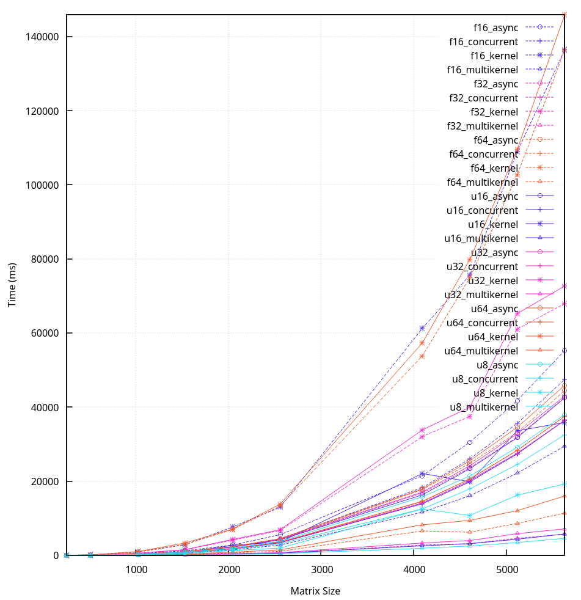

## GEMM optimizations

GEMM (general matrix multiplication) in zig. With a nice plot to go alongside it.

Each implementation is given the dimensions and major of each matrix (including the desired major for C).

It should always take major into account for the best possible route (I don't want to implement two functions for each optimization).

## Implementations

1. Naive (single-threaded)
   * Just plays nice with the majors, but nothing else outside of it
2. async
   * calls io.async for inner loops
3. concurrent
   * calls io.concurrent for inner loops
      * better than async (actual thread pool)
4. evented
   * calls io.concurrent, but using std.Io.Evented
      * Evented doesn't follow a thread pool structure, so it is probably worse than concurrent (curious to see if it would be better than async though)
         * broken until (this is merged)[https://codeberg.org/ziglang/zig/pulls/31764]
4. kernel
   * macrokernel and microkernel with packing and SIMD, but single threaded and hard-coded block and tile sizes
   * this is more of a implementation checkpoint before going full multithreaded, which means it doesn't necessarily play nice with majors of A and B (since they don't really change anything for the multithreaded kernels code)
5. multikernel (TODO column major code)
   * macrokernel and microkernel with packing, SIMD and multithreaded, but hard-coded block and tile sizes
      * 4 accumulators for microkernel

## Experiments

To run experiments, just run `zig build run -Doptimize=ReleaseFast`.

You can generate the plot with `./plot.sh`.

Tweak the top of the `benchmark` function in `main.zig` to exclude certain implementations, sizes and datatypes.

* On Debian linux, on a ryzen 7 5700U:

